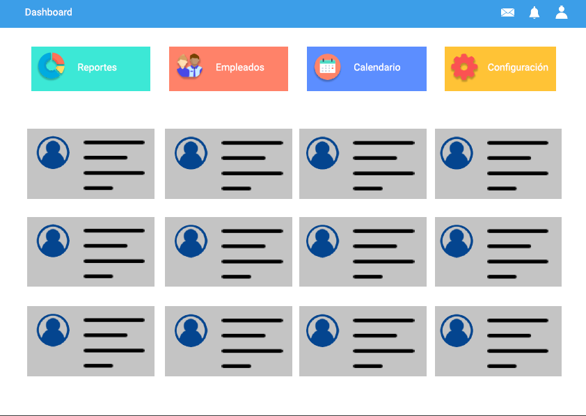
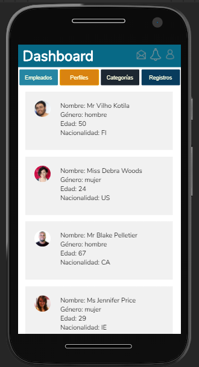
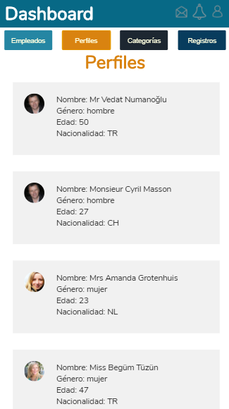
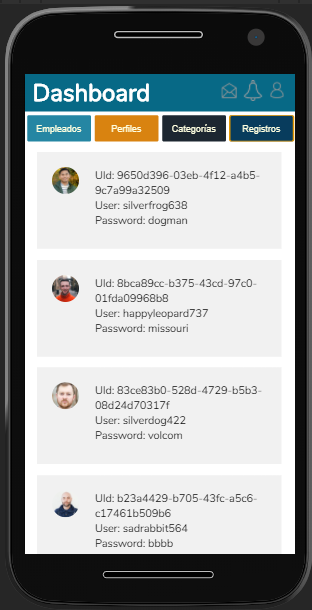
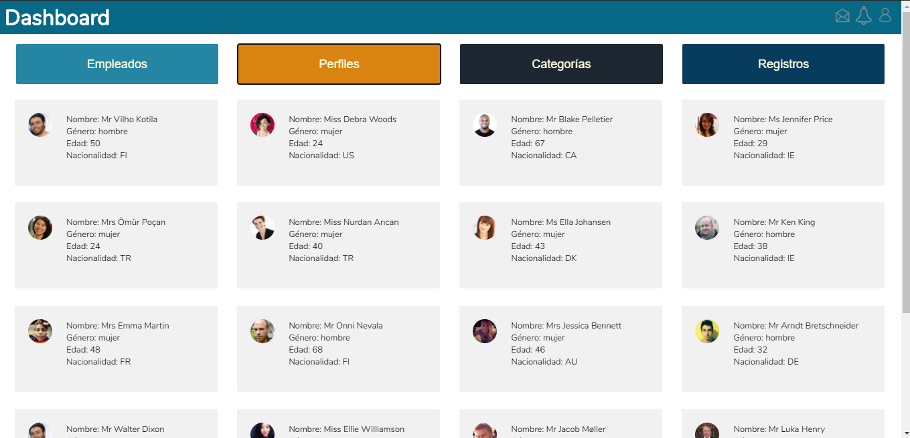
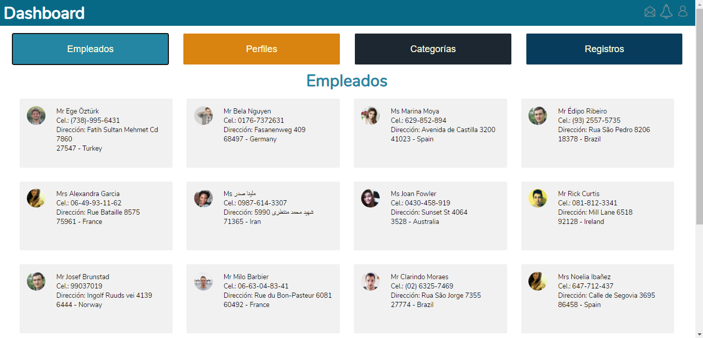

# PROYECTO [DASHBOARD](https://npgonzalez.github.io/dashboard/src/) - ECOMSUR

Este proyecto consiste en la creación de un dashboard de acuerdo con pautas señaladas desde ECOMSUR. La información proviene de una API proporcionada para el desarrollo del mismo.
Tiempo para su creación 24 horas... 

En la siguiente imagen se observa la interfaz propuesta.

### Vistas del PROYECTO

* Vista Inicial

* Vista Empleados

En esta vista es posible obtener los datos de contacto de los empleados.

* Vista Perfiles

En esta vista se ecuentran algunos datos demográficos de los empleados.

* Vista Categorías

En esta vista se puede conocer la categoría en la que se encuentra cada uno de los empleados, en relación con el año de registro en la plataforma. Categorías posibles: Junior, Semi-senior y Senior.

* Vista Registros

En esta vista se pueden encontrar los datos de registro de los empleados; tales como: Id del empleado, username y password.

* Vista Desktop

